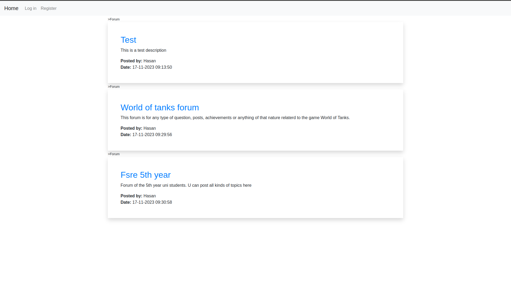
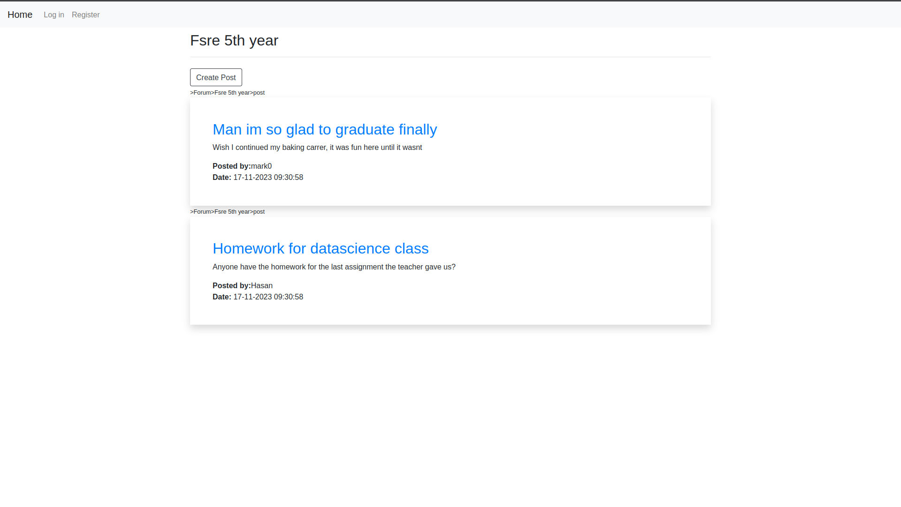
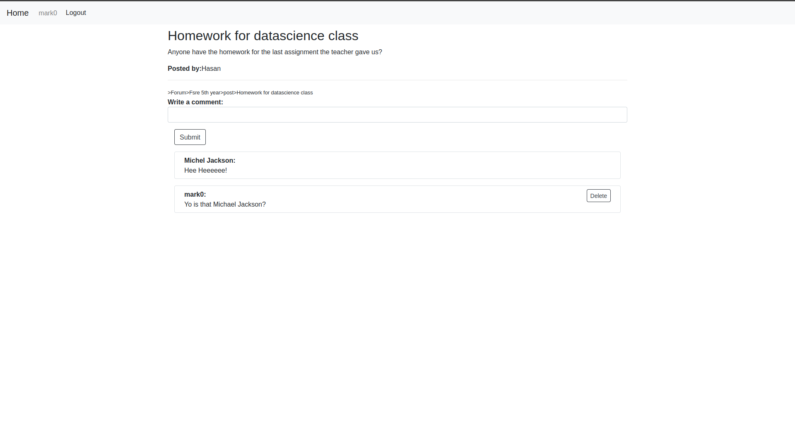
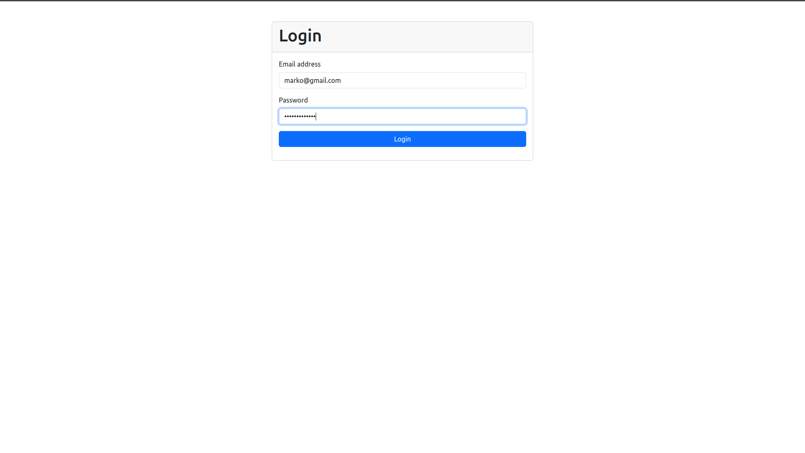

<h1 align="center" id="title">Forum app</h1>

<p id="description">This application is class project made from Laravel full stack framwork and its designe to be a forum.</p>

<h2>🚀 Demo</h2>

<h2>Project Screenshots:</h2>







  
  
<h2>🧐 Features</h2>

Here're some of the project's best features:

*   Ability to Register and Log in
*   Ability to post forums posts and comments
*   Only 'owners' of the forum posts and comments get to modify their stuff

<h2>🛠️ Installation Steps:</h2>

<p>1. Cloning the project</p>

```
git clone git@github.com:CaniTanushaj/SBP_Forum.git
```

<p>2. Installing composer</p>

```
composer install
```

<p>3. Generating project key</p>

```
php artisan key:generate
```

<p>4. Setup the .env file</p>

<p>5. Make migrations</p>

```
php artisan migrate 
```

<h2>🍰 Contribution Guidelines:</h2>

  
  
<h2>💻 Built with</h2>

Technologies used in the project:

*   Laravel
*   Blade Templates
*   Eloquent
*   Auth sanctum
